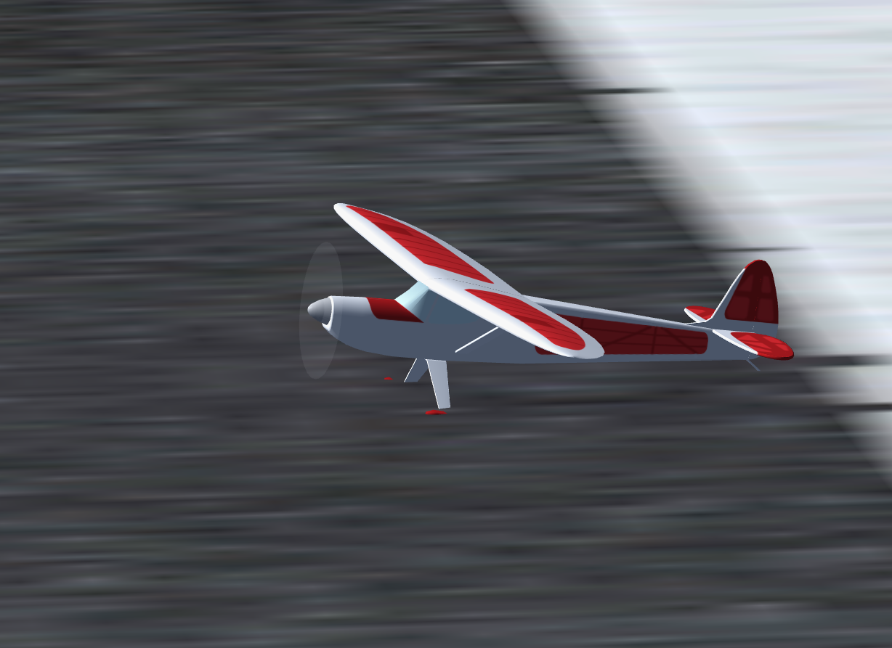

## Rascal 110  RC plane model

The FlightGear numerical model fits to JSBsim and YASim flight dynamics models (FDM).

This repository contain a fork from [FGAddon repository](https://sourceforge.net/p/flightgear/fgaddon/HEAD/tree/trunk/Aircraft/Rascal/). The original model was improved by fixing corrupted YASim file.

### YASim model

